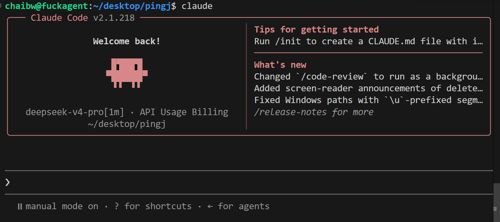
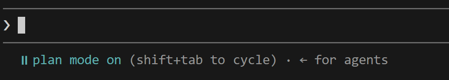
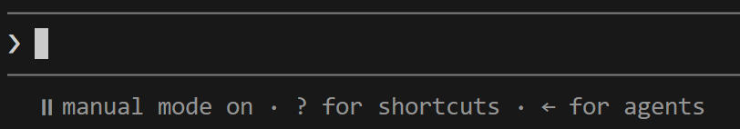
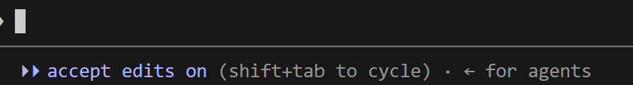
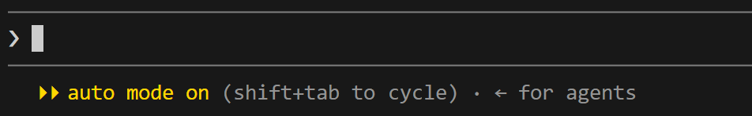
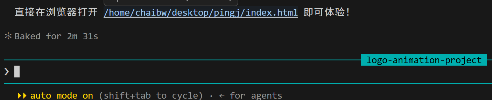

# ClaudeCode快速上手！

## （一）安装CC并配置“大脑”

### 一、 安装 CC (Claude Code)

根据你的操作系统，选择以下一种方式进行安装：

**1. Mac / Linux 环境**
在终端中执行官方安装脚本：

```bash
curl -fsSL https://claude.ai/install.sh | bash
```

*提示：如果安装后提示 `claude: command not found`，请执行以下命令将路径加入环境变量，并重启终端：*

```bash
echo 'export PATH="$HOME/.local/bin:$PATH"' >> ~/.zshrc && source ~/.zshrc
```

**2. Windows 环境**
Windows 依赖 Git 来执行脚本，请先确保已安装 Git（可通过 PowerShell 执行 `winget install Git.Git` 安装）。随后推荐使用微软官方包管理器一键安装：

```powershell
winget install Anthropic.ClaudeCode
```

*注意：安装完成后，必须关闭当前命令行窗口并重新打开一个新的 PowerShell，以便刷新环境变量。*

**3. 备用安装方式（NPM）**
如果上述网络安装方式受阻，在确保本地已安装 Node.js 的前提下，可通过 npm 全局安装：

```bash
npm install -g @anthropic-ai/claude-code
```

---

### 二、 配置“大脑”（接入 API）

CC 安装完成后，直接运行 `claude` 命令在国内网络下通常会报连接错误。为了接入自定义模型，推荐使用 **CC Switch** 这款开源配置管理工具，它可以帮你一键切换 API 供应商。

**1. 安装 CC Switch**

- **macOS 用户**：通过 Homebrew 安装
    
    ```bash
    brew tap farion1231/ccswitch
    brew install --cask cc-switch
    ```
    
- **Windows 用户**：前往 CC Switch 的 GitHub Releases 页面下载 `.msi` 安装包或 `.zip` 便携版，安装或解压后运行即可。

**2. 获取 API Key**
前往你选择的第三方模型服务商（如 DeepSeek、魔芋AI 等）注册账号，充值并在控制台的“API Keys”或“令牌管理”页面生成你的专属 API Key。

**3. 在 CC Switch 中添加供应商**

1. 打开 CC Switch 客户端。
2. 点击主界面左上角或右上角的 **“+” (添加)** 按钮。
3. 在弹出的窗口中选择预设的供应商（如 DeepSeek），或选择“自定义配置”。
4. 填入你的 **API Key**，确认请求地址无误后，点击添加。

**4. 启用配置**
在供应商列表中找到刚刚添加的配置，点击右侧的 **“启用” (Enable)** 按钮。当状态变为 Active（使用中）时，配置会自动写入 CC 的相关文件中。

**5. 验证生效**
重启你的终端，再次输入 `claude` 启动程序，并随便发送一句测试语。如果能收到正常回复，说明“大脑”配置成功！

---

## （二）召唤！来做一个项目吧！

> 在终端输入 claude 即可召唤成功！
> 



### 一、CC的4种权限模式

<aside>
💡

用 **Shfit+Tab** 切换权限模式

</aside>

#### 计划模式 Plan Mode



> 不直接执行，制定详尽计划，确认后执行。
> 

#### 手动模式



> 先询问再执行。
> 

#### 自动编辑 Accept Edits



> 自动文件修改，运行命令需要确认。
> 

#### 自动模式 Auto mode



> 全权委托，不再询问。
> 

---

### 二、输入你的第一条命令

#### 基础交互

> 在这里，我想让claude code制作一个能够生成logo动画的网站。
> 



> 打开链接，看看claude code的强大之处！
> 

> 如果想用 Bash 模式输入命令呢？在命令前面加上一个 ! 即可（!必须是英文模式）
> 

#### 进阶交互

- **`@file <文件名>`**：指定某个具体文件作为上下文。例如：“帮我检查 @src/main.py 里的内存泄漏问题”。
    
    > 遇到太长太多的提示词，一个很好的解决方案是把提示词写入一个文件中（.txt），再利用 `@文件名` 告诉claude code，让它遵循文件中的提示词。
    > 
- **`@folder <文件夹名>`**：让 AI 关注整个模块。例如：“根据 @docs/ 下的文档更新 @src/api/ 的代码”。
- **`@git-commit <hash>`**：引用某次 Git 提交记录，让它解释代码变更或基于该提交进行回滚/修改。
- **`@terminal`**：引用上一次终端报错的输出。当你遇到报错时，直接复制报错信息太麻烦，可以直接说“修复 @terminal 里的错误”。
- 提供图片参考

#### 常用斜杠命令

- **`/init`**：**项目初始化（非常重要）**。
    - 在项目根目录运行此命令，CC 会自动扫描你的代码库结构、技术栈和依赖文件，并生成一个 `.clinerules` 或类似的上下文配置文件。这能让 AI 迅速“懂”你的项目规范。
- **`/compact`**：**压缩上下文**。
    - 当对话过长导致 Token 消耗巨大或 AI 开始“遗忘”之前的指令时，使用此命令可以将当前的对话历史总结为精简的摘要，释放上下文窗口，同时保留关键信息。
- **`/clear`**：**清除当前会话**。
    - 开启一个全新的话题，不再受之前对话干扰。
- **`/status`**：**查看当前状态**。
    - 显示当前的 Token 使用量、API 连接状态以及正在运行的后台任务。
- **`/model`**：**切换模型**。
    - 如果你配置了多个模型（例如通过 CC Switch），可以用此命令快速在 `opus` (最强逻辑)、`sonnet` (均衡) 或 `haiku` (极速) 之间切换。
- `/btw`**：补充提示。**
    - 在开发一个项目时，我们想查询与项目无关的问题，就可以用该条命令，claude code会另辟一个新窗口回答而不会影响原项目的开发。
- `/simplify`**：代码重构与优化。**
    - **去除冗余**：删除未使用的变量、导入、死代码以及重复的逻辑块。
    - **语法现代化**：将老旧的写法（如 `var`、传统的 `for` 循环）替换为现代语法（如 `const/let`、`map/filter/reduce`、解构赋值等）。
    - **提升可读性**：简化复杂的嵌套 `if-else`（例如使用“卫语句”提前返回），拆分过长的函数，优化变量命名。
    - **性能微调**：在不改变功能的前提下，选择时间复杂度更低或内存占用更少的实现方式。
- `/resume`**：恢复中断或挂起任务**

---

## （三）管理！一切尽在掌控之中！

### 1. 会话与历史管理

- **恢复历史会话**：如果你不小心退出了终端，或者想继续之前的工作，可以使用 `/resume` 命令来选择并恢复历史会话。你也可以在启动 CC 时直接带上 `c` 参数（即 `claude -c`）来快速续聊。
- **重置干净会话**：当上下文被无关信息污染，或者你想开启一个全新话题时，使用 `/clear` 命令可以开启一个干净的会话。

### 2. 上下文与 Token 管理

- **压缩上下文**：在长对话中，当上下文窗口占用超过 70% 时，CC 可能会开始“遗忘”早期指令。此时使用 `/compact` 命令可以压缩历史对话，释放空间。
- **精简配置文件**：如果你配置了 `CLAUDE.md`，请保持其精简（建议控制在 200 行以内）。如果 CC 本身就能做对的事，就无情地删掉那条指令，避免重要规则被淹没。

### 3. 项目配置与记忆管理

- **初始化项目记忆**：在项目根目录运行 `/init`，CC 会自动为你生成一个 `CLAUDE.md` 模板文件，方便你快速定义项目规范。
- **精确控制记忆**：你可以通过编辑 `Memory` 标签，来精确控制 CC 在项目中应该记住什么、或者忽略什么。
- **定期清理**：定期清理 memory、文件和指令，不相关的工作流建议分开项目，以避免上下文污染。

### 4. 任务执行与纠错控制

- **中断与回退**：发现 CC 跑偏时，可以按 `ESC` 键随时中断它的操作。如果改错了，双击 `ESC` 或输入 `/rewind` 可以打开检查点菜单，回滚到上一个正常的状态。
- **纠正策略**：如果连续纠正两次 CC 还是做错，建议直接使用 `/clear` 开启新会话，并写一个包含之前教训的、更好的初始提示词。

---

## （四）个性化设置

### 配置CLAUDE.md

Claude Code 支持多级 `CLAUDE.md` 文件，它们会按优先级叠加生效：

- **全局级 (`~/.claude/CLAUDE.md`)**：作用于你电脑上的所有项目。适合存放个人通用偏好（例如：“我喜欢 2 空格缩进”、“始终用中文回答我”）。
    
    > 1.命令claude code创建一个全局的CLAUDE.md（告诉它写入什么）2. 输入`/memory` 再选择
    > 
- **项目级 (`./CLAUDE.md`)**：放在项目根目录。**强烈建议将其提交到 Git**，这样团队成员拉取代码后，大家的 AI 助手都会遵循同一套规范。
    
    > 建议不要在空项目下自己手动创建CLAUDE.md，而是等到项目有了一定雏形后，再用 `/init` 初始化它，agent会自动生成一份CLAUDE.md
    > 
- **本地私有级 (`./CLAUDE.local.md`)**：同样在项目根目录，但应加入 `.gitignore`。适合存放仅属于你个人的偏好（例如队友用 `pip`，而你习惯用 `uv`）。
- **子目录级 (`./current-dir/CLAUDE.md`)**：按需加载。只有当 AI 操作到该子目录时才读取，适合存放特定模块的规则（例如 `src/components/CLAUDE.md` 规定组件必须用函数式声明）。

<aside>
💡

全局级md：

- 不要塞太多内容
- 最顶层、长期稳定的原则
- 逐步添加高频错误修正

项目级md：

- 跟随项目开发变化（添加功能、更新要求、CC踩坑都要同步更新md）
</aside>

---

### Auto-memory

> 输入 `/memory` → “Auto-memory”保持“on”的状态（打开）
> 

**核心记忆内容：**

- 用户身份：关于个人的角色、偏好
- 反馈：我们给的一些反馈（“不要这样”“对了”）
- 项目信息：项目相关的进度、决策、技术选型
- 参考：外部资源

> 自动记忆文件夹只作用于我们所在**项目**。
> 

<aside>
💡

**CLAUDE.md**：第一优先级，全部注入；用户主动确定的规则

**Auto-memory**：第二优先级，按需加载；Agent自主提取记录

</aside>

---

### 编写文档

> 自己编写要求文档，规定何时参考
> 

---

## （五）CC高级扩展

### 1. Skill —— 注入领域知识的“技能包”

[上手Agent SKILL](./上手AgentSKILL.md)

Skill 是 Claude Code 最灵活、最轻量级的扩展方式。它本质上是一个 Markdown 文件，存放于 `~/.claude/skills/` 或项目根目录的 `.claude/skills/` 下。当你调用某个 Skill 时，AI 会自动加载其中预设的规则、模板或工作流，从而精准执行特定任务。

- **适用场景**：
    - 生成符合团队规范的代码（如 Java 分层架构、React 函数式组件）
    - 执行标准化流程（如修复 GitHub Issue、生成 API 文档）
    - 注入行业知识（如金融风控规则、医疗数据脱敏规范）
- **配置示例**：
    
    ```markdown
    ---
    name: java-layered-arch
    description: 生成符合分层架构的 Java 代码
    trigger: 生成Java代码, 写Controller, 写Service
    ---
    # 规范说明
    - Controller 层只负责参数校验和路由分发
    - Service 层处理业务逻辑，禁止直接操作数据库
    - Mapper 层仅做数据访问，不包含任何业务判断
    ```
    
- **优势**：无需编写代码，纯文本定义；支持参数传递（如 `/fix-issue [issue-number]`）；可与 SubAgent 配合实现自动化流水线。

---

### 2. MCP —— 连接外部世界的“USB 接口”

MCP（Model Context Protocol）是 Claude Code 与外部服务通信的标准协议。通过 MCP，AI 可以直接操作 GitHub、Sentry、PostgreSQL、Figma、SAP 等工具，无需你手动切换界面或复制粘贴数据。

- **适用场景**：
    - 查询数据库并生成报告
    - 自动创建 GitHub Issue 或 PR
    - 从 Figma 获取设计稿并生成前端代码
    - 调用企业内部 API 或监控系统
- **配置方式**：
    
    在 `~/.claude/settings.json` 中添加 MCP 服务器地址：
    
    ```json
    {
      "mcpServers": {
        "github": { "type": "http", "url": "https://api.githubcopilot.com/mcp/" },
        "sentry": { "type": "http", "url": "https://mcp.sentry.dev/mcp" }
      }
    }
    ```
    
- **企业级管控**：可通过 `managed-mcp.json` 强制指定可用服务器，确保合规与安全。

---

### 3. CLI —— 终端里的“结对编程伙伴”

CLI 是 Claude Code 的核心交互界面，它不仅支持自然语言对话，还能直接读写文件、执行命令、理解项目结构。你可以通过命令行参数或内置指令来控制其行为。

- **常用指令**：
    - `/resume`：恢复中断的会话
    - `/compact`：压缩上下文，释放 Token
    - `/clear`：开启全新会话
    - `/rewind`：回滚到上一个检查点
- **启动参数**：
    - `-add-dir ../lib`：额外加载工作目录
    - `-model claude-opus-4`：指定模型版本
    - `-verbose`：开启详细日志
- **VS Code 集成**：安装官方扩展后，可在 IDE 内直接使用 Spark 图标唤起 CC，支持并排 Diff、@提及、计划审阅等功能。

---

### 4. SubAgent —— 隔离执行的“专项专家”

SubAgent 是在独立上下文中运行的子代理，专门处理高复杂度或高风险任务。它不会污染主会话的上下文，适合并行处理或需要严格权限控制的场景。

- **适用场景**：
    - 批量代码审查（安全、性能、可维护性）
    - 大规模重构（多文件同步修改）
    - 研究类任务（阅读大量文献、分析竞品）
- **配置示例**：
    
    ```markdown
    ---
    name: code-reviewer
    description: 审查代码质量、安全性和最佳实践
    tools: Read, Glob, Grep, Bash
    disallowedTools: Write, Edit
    model: sonnet
    maxTurns: 50
    isolation: worktree
    ---
    你是一个代码审查专家。分析代码并提供具体、可执行的反馈。重点关注：安全性、性能、可维护性。
    ```
    
- **调用方式**：
    - 自然语言描述任务，AI 自动委派
    - `@code-reviewer 看看 auth 模块的改动`
    - `-agent code-reviewer` 启动专用会话

---

### 5. 其他插件 —— 生态扩展的“万能工具箱”

除了上述四大核心模块，Claude Code 还支持丰富的第三方插件，进一步拓展其能力边界。这些插件通常以 Skill 或 MCP 的形式存在，可通过插件市场一键安装。

- **推荐插件**：
    - **Oh My Claude Code (OMC)**：提供 Planner → Architect → Executor → QA → CodeReviewer 的完整工作流，支持 Ultrawork 并行模式，大幅提升大型项目效率。
    - **Everything Claude Code**：集成任务规划、数据库管理、API 调试等实用功能。
    - **Supabase CLI**：直接在 CC 中操作 Supabase，创建表、管理用户、配置 RLS 策略。
    - **agents-cli**：Google 推出的 Agent 开发工具包，支持与 Gemini CLI、Codex 等协同工作。
- **安装方式**：
    
    ```bash
    /plugin marketplace add affaan-m/everything-claude-code
    /plugin install everything-claude-code
    ```
    

---
