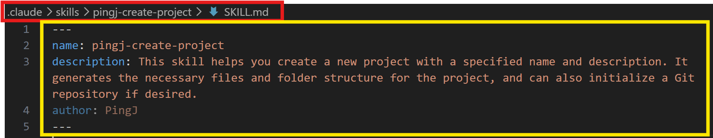
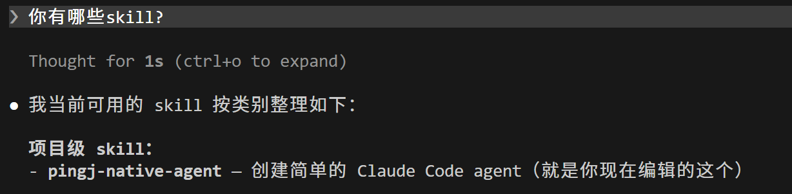
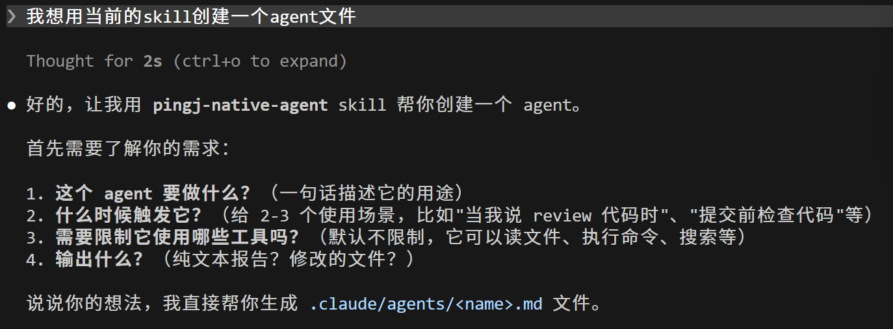
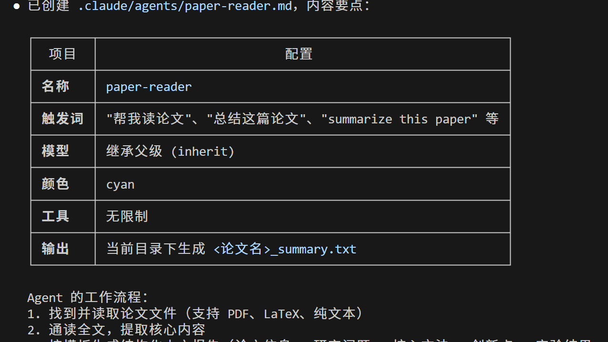
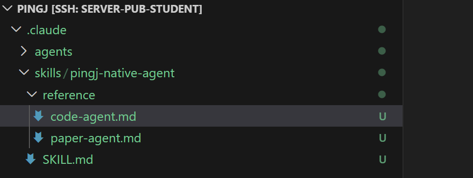

# 上手Agent SKILL

---

## 什么是SKILL

> 以炒菜做个类比：
> 
> 
> 
> | 流程 | 炒菜顺序 | SKILL.md |
> | --- | --- | --- |
> | 配方 | 油温，各种调料的用量 | references |
> | 工具 | 炒锅，煤气灶 | scripts |
> | 材料 | 原材料，独家配料 | assets |
> 
> 这些东西打包成一个文件夹，就是“SKILL”。
> 

## 创建SKILL

### SKILL.md

<aside>
💡

和普通promt文件有什么区别？

**提示词解决的是“这一次”的意图表达，而 SKILL.md 解决的是“这一类”任务的流程沉淀**。

**加载机制不同：**

- **普通提示词**：每次对话都需要携带完整的指令集，这会消耗大量 Token，且随着内容增多容易导致上下文污染和 AI 注意力分散。
- **SKILL.md**：采用“渐进式披露（Progressive Disclosure）”机制。系统启动时只加载极少量 Token 的元数据（L1发现层）；当任务匹配触发时，才加载 `SKILL.md` 的完整指令（L2激活层）；在执行过程中，才会按需读取引用的参考文档或脚本（L3执行层）。这极大节省了上下文成本。
</aside>

> 在项目文件夹下创建 .claude 文件夹 → 在.claude之下创建skills文件夹 → 在skills之下创建(技能名称)文件夹 → 在你创建的技能文件夹下创建SKILL.md
> 



> 红色边框中就是路径。
> 

> 黄色边框中的叫做“**元信息**”（metadata）。
> 

> metadata下面就是 **instruction（指令）**。
> 

例子：（我创建的skill里面的内容是想让CC生成agent的提示词）

```markdown
---  
name: pingj-native-agent
description: A native agent skill that can execute commands on the host machine and return the results.

---  

  1. When to use — trigger conditions so the harness knows when to load this skill
  2. Agent anatomy — directory structure (project/.claude/agents/<name>.md) and the YAML frontmatter fields (name, description,
  model, color, tools)
  3. Step-by-step creation — 5 steps: gather requirements → choose name → write the file → validate → confirm with user
  4. A fill-in-the-blanks template — ready-to-copy markdown skeleton with all required sections (role, when-to-invoke,
  responsibilities, process, output format, edge cases)
  5. Validation checklist — 6 items to verify before considering the agent done
  6. A complete worked example — commit-lint agent showing what the final file looks like
```

> 当我们问CC有哪些skill时，就能看到我们创建的skill了。
> 
> 
> 
> 

> 输入指令，让CC用我们创建的skill搭建一个简单的agent
> 
> 
> 
> 

> 当我按照要求明确我的目的时，CC就会给我想要的答案
> 
> 
> 
> 

---

### Reference

**为什么要单独放在 references 中？**

这主要是为了避免“Token 爆炸”并提高 AI 的执行效率。如果将所有长篇大论的细节、复杂规则都塞进核心的 [`SKILL.md](http://SKILL.md)` 文件中，不仅会撑爆上下文，还会导致 AI 难以精准召回关键信息（即 context rot 现象）。

**核心设计思想：渐进式披露（Progressive Disclosure）**

`references` 采用了“用多少、读多少”的按需加载机制。

- 在初始阶段，这些资料**不会**被自动加载到上下文中。
- 只有当 AI 在执行任务过程中，`SKILL.md` 的指令明确指示或执行过程确实需要查询某些细节时，AI 才会主动去读取 `references` 中的对应文件。

> 依旧以我创建的用于生成agent的skill为例，我想生成不同类型的agent，它们的指令也会各不相同，如果把这些指令都塞到一个SKILL.md文件中，且不说“长篇大论”，更糟糕的是每次调用skill都会造成”token消耗巨款“。因此，我么就用到了reference。
> 
> 
> 
> 
> 这时候，我们在SKILL.md中只需留下必要的指令，以及何时查看对应的reference中的.md文件。
> 

---

### Scripts

> 在 CC Skill 体系中，`scripts` 文件夹是技能的“手脚”或“自动机器”。如果说 `SKILL.md` 是 AI 的大脑，负责思考和规划，那么 `scripts` 就是 AI 真正用来干活的工具。它的核心作用是**把确定性、重复性的操作交给固定脚本处理**，从而让 AI 的输出更加稳定可靠。
> 

**1. 存放什么内容？**

`scripts` 文件夹中存放的是可以直接在终端运行的代码文件。常见的包括：

- **Python 脚本**：用于数据清洗、解析文件（如 PDF、日志）、复杂数学计算等。
- **Shell/Bash 脚本**：用于操作本地文件、调用外部 API、环境初始化等。
- **其他可执行程序**：如 JavaScript (Node.js)、Go 等编写的自动化脚本。

**2. 为什么要用 scripts 而不是让 AI 自己写代码？**

- **保证稳定性**：大模型在每次执行时可能会有不稳定的发挥。对于有明确输入、规则和输出的任务（如格式验证、文本清洗），使用固定脚本能避免 AI “这次删了时间戳，下次又忘了”的问题，确保每次产出一致。
- **节省 Token**：脚本本身的代码不需要读入 AI 的上下文窗口，AI 只需要知道“运行这个脚本”，然后接收脚本执行后的结果即可。这大大节省了上下文空间，避免了 Token 爆炸。

**3. 核心设计思想：职责分离**
在优秀的 Skill 架构中，讲究“资料、流程和质检各归其位”：

- **AI 负责思考**：提炼观点、组织结构、判断逻辑。
- **Scripts 负责执行**：执行标准化的数据处理、API 调用、文件转换。

**4. 典型应用场景**

- **素材预处理**：在创作文章前，运行一个脚本把包含时间戳、乱码、口头禅的原始转写稿清洗成干净的 Markdown 文本，再交给 AI 提炼观点。
- **文件处理**：批量旋转 PDF、解密音频文件、分析服务器日志。
- **代码校验**：在代码审查时，运行静态检查脚本验证代码规范，AI 再根据检查结果给出建议。

**5. 最佳实践建议**

- **明确调用指令**：在 `SKILL.md` 中清晰地写明何时运行脚本，例如：“请先执行素材清洗 script，拿到清洗后的 Markdown 文本后，再进入观点提炼阶段。”
- **只做确定性任务**：不要将需要模糊判断或主观创造的任务交给脚本，脚本只处理有明确输入输出规则的机械性工作。

---

### Assets

> 在 CC Skill 体系中，`assets` 文件夹扮演着技能的“工具箱”或“素材库”的角色。它的核心作用是**提供静态资源和模板，用确定性的资源替代概率性的生成**，从而保证 AI 输出的稳定性和规范性。
> 

**1. 存放什么内容？**

`assets` 文件夹中存放的是成品模板和各类静态资源文件，通常不需要 AI 去理解或阅读其内部逻辑，而是直接引用。常见的包括：

- **文档模板**：如 PPT 模板（`weekly-report.pptx`）、报告模板（`report.md`）、检查清单（`checklist.md`）。
- **品牌视觉**：如公司 Logo（`logo.png`）、特定的字体文件（`font.ttf`）、各种天气图标。
- **代码/前端模板**：如前端项目模板文件夹（`frontend-template/`）、示例代码（`example.html`）。

**2. 为什么要用 assets 而不是让 AI 自己生成？**

- **保证格式与风格统一**：大模型每次生成的内容可能会有细微差别。使用固定的模板，可以确保每次生成的周报、海报或文档都符合公司的统一规范。
- **无需消耗上下文**：与 `references` 中的文档不同，`assets` 里的文件（如图片或 PPT）不需要被读入 AI 的上下文窗口中，AI 只需要知道文件的路径，在最终生成环节直接调用即可。

**3. 核心设计思想：确定性替代概率性**
在优秀的 Skill 架构中，`assets` 解决了 AI 容易“自由发挥”的问题。对于有严格排版要求或品牌视觉要求的任务，把现成的模板放进去，AI 只需要把生成的内容“填”进模板里，这属于工程上的“确定性能力”。

**4. 典型应用场景**

- **生成汇报材料**：用户要求“做个公司介绍 PPT”，AI 直接从 `assets` 里拿出 `weekly-report.pptx`，填入内容后输出。
- **代码审查**：AI 审查完代码后，严格按照 `assets/checklist.md` 的格式和 `assets/templates/report.md` 的模板输出审查报告。
- **内容创作配图**：在生成一篇关于天气的文章时，AI 根据天气情况，自动插入 `assets/icons/` 下的 `sunny.png` 或 `rainy.png`。

**5. 最佳实践建议**

- **在 SKILL.md 中明确引用**：清晰地写明何时、如何使用这些资源。例如：“最终输出时，请使用 `assets/templates/report.md` 作为排版格式。”
- **保持资源纯净**：`assets` 里只放不需要被 AI 阅读和修改的“死”文件。如果某个文件需要 AI 阅读并参考其中的知识，请把它放到 `references` 文件夹中。

---

## 回顾SKILL四件套是如何合作的

假设我们有一个名为 `weekly-report` 的 Skill，它的目录结构如下：

```
weekly-report/
├── SKILL.md             # 大脑：定义工作流和指令
├── references/          # 图书馆：存放参考知识
│   └── writing-guidelines.md
├── scripts/             # 手脚：执行确定性任务
│   └── extract_jira.py
└── assets/              # 模具：存放固定模板
    └── report-template.md
```

当用户输入：“帮我生成本周的项目周报”时，AI 的后台执行流如下：

### 1. 触发与规划（SKILL.md 主导）

AI 读取 `SKILL.md` 中的指令，明确了做周报需要分为三步：收集数据 -> 提炼总结 -> 格式化输出。

### 2. 第一步：收集数据（调用 scripts）

AI 知道原始数据在 Jira 系统里，自己无法直接抓取。于是它执行指令：

> *“运行 `scripts/extract_jira.py` 获取本周任务列表。”*
> 

脚本在后台静默运行，把复杂的 Jira 数据清洗成干净的文本，返回给 AI。**（AI 不用自己写爬虫，也不用消耗 Token 去读 Jira 的原始 JSON）**

### 3. 第二步：提炼总结（AI 思考 + 查阅 references）

AI 拿到了本周的任务列表，准备写总结。为了确保语气和格式符合公司要求，它执行指令：

> *“阅读 `references/writing-guidelines.md`，按照规范提炼本周进展和下周计划。”*
> 

AI 将任务列表和写作指南结合，发挥大模型的归纳能力，生成了周报的核心文字内容。**（按需加载，不污染上下文）**

### 4. 第三步：格式化输出（套用 assets）

文字写好后，AI 执行最后一步指令：

> *“将生成的内容，严格按照 `assets/report-template.md` 的格式进行填充。”*
> 

AI 把写好的文字“填”进固定的 Markdown 模板中，最终输出了一份排版完美、格式统一的周报。**（保证了每次周报的长相都一样）**

---

<aside>
💡

SKILL.md是必要的，剩下三个是可选的。

渐进式披露：元信息始终加载；指令层按需加载；资源层按需加载

</aside>

---

> Q：创建skill好麻烦😕。。又是脚本又是指令的😓。。
> 
> 
> A：其实，在实际生活中，创建skill的最常用的手段是“让skill去创建skill”，有很多好用的生成skill的skill文件可供下载使用。
>
